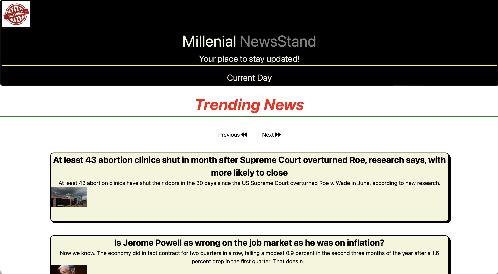

**# Project1- Millenial NewsStand**

**# Purpose**

We created a News channel where all the lastest news will be accesible for this generation. We are always looking for easy and quick information.

The Millennial Newsstand is a hub for our generation to quickly and easily access the latest headlines and our local five day forecast at a glance.

Given a news dashboard 
Then I am presented with the current headlines around the world and the current five day weather  forecast for my chosen location. When I want to look at the information at a different time, then I can quick access the last searched location in my search history.

**# Programs used**

1. HTML.
2. CSS.
3. Tailwind CSS.
4. JavaScript.
5. Moment JS

**# Website & Screenshot**

https://nick9850.github.io/NewsStand/

**# Contribution**

1. Brenda Sosa   https://github.com/brendasosa0721
2. Nadia Bachhus  https://github.com/nbacchus
3. Nick Reitmeyer https://github.com/Nick9850

